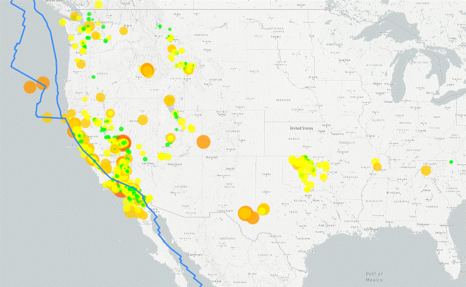

# leaflet-challenge
* This project creates a map visualization that allows the user to choose what to display on the map

## Programming Languages
* HTML - display platform
* CSS - formatting for display format
* JavaScript - allows for dynamic display from multiple data samples
    * D3 - used to read in the JSON files and create the data sets
    * Leaflet - used to build the layers of the map
    * mapbox API - used for the background tile layers
        * you will need an API key for this
            * create a config.js file and place in the /static/js folder
            * in the config file set API_KEY = "\<your API key>"

## Data
* The earthquake data comes from a geoJSON file from the usgs.gov website (https://earthquake.usgs.gov/earthquakes/feed/v1.0/summary/all_week.geojson)
* The fault line data comes from a geoJSON file from https://github.com/fraxen/tectonicplates

## Visualizations
* World Map 
    * Background Map Choices:
        * Light background
        * Outdoor background
        * Satellite background
    * Overlay Map Choices:
        * Earthquakes (for the past week)
        * Fault Lines
    * User can zoom and move around on map

Sample Map showing the US with both the earthquake and faultline layers
